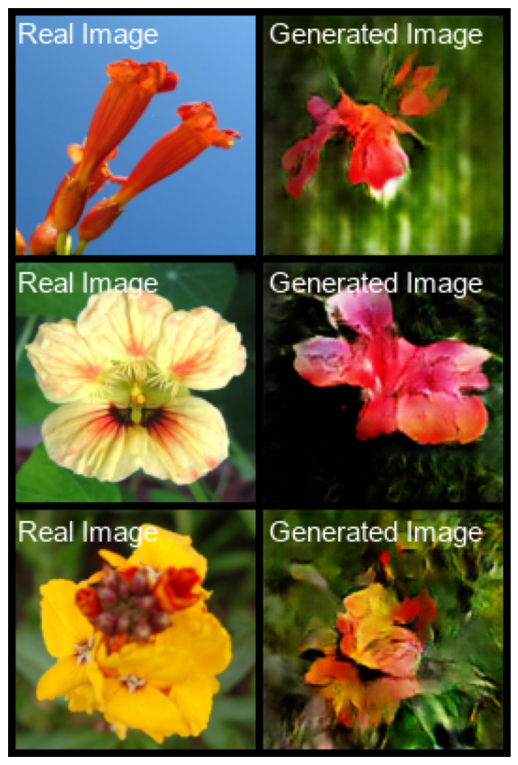
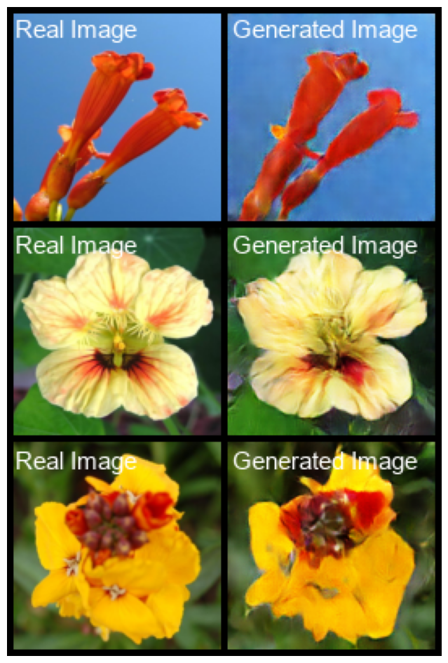

# DCGANs-Text2Img

This project examine the power of Conditional GANs along with a Sentence BERT model to generate diverse and realistic flower images from textual descriptions. My goal is to create visually compelling images based solely on input text.

## Project Overview

We are exploring two distinct training strategies:
- **Traditional Loss Functions:** Leveraging conventional GAN loss metrics.
- **Contrastive Loss Functions:** Integrating contrastive loss to better align semantic features between text and image. 

<figure>
    
    <figcaption style="text-align: center; font-style: italic; margin-top: 5px;">Traditional GAN Loss</figcaption>
</figure>

<figure>
    
    <figcaption style="text-align: center; font-style: italic; margin-top: 5px;">Contrastive GAN Loss</figcaption>
</figure>

